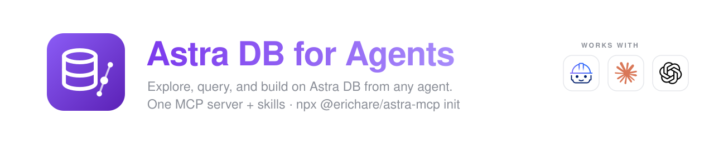
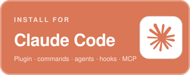
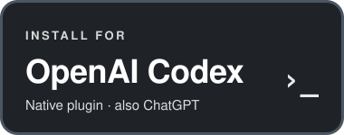
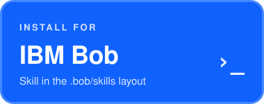

  

  
  
  
  

  <b>5 client languages · ~1,660 doc-synced Data API snippets · ~420 always-on tokens · skillsaw A+</b>

One skill, one source of truth, three native packagings. The content is the `astra-toolkit` skill by Stefano Lottini (IBM / DataStax) — progressive-disclosure instructions for the Astra CLI, application architecture, data modeling for Collections and Tables, and roughly 340 documentation-derived Data API snippets for each of Python, TypeScript, Java, C#, and Go. It is self-sufficient (no web lookups) and synced automatically from [sl-at-ibm/astra-toolkit-skill](https://github.com/sl-at-ibm/astra-toolkit-skill).

## Install

Pick your agent — one command each.

<table>
  <tr>
    <td align="center" width="33%"></td>
    <td align="center" width="33%"></td>
    <td align="center" width="33%"></td>
  </tr>
  <tr>
    <td valign="top">
<pre><code>claude plugin marketplace add erichare/astra-db-plugin
claude plugin install astra-db@astra-db-marketplace</code></pre>
Plugin with the skill, commands, agents, hooks, and MCP server.
    </td>
    <td valign="top">
<pre><code>codex plugin marketplace add erichare/astra-db-plugin</code></pre>
Then <code>/plugins</code> → <b>Astra DB</b>. Native plugin with the skill, hooks, and MCP server; also shows up in the ChatGPT app's Plugins tab.
    </td>
    <td valign="top">
<pre><code>curl -fsSL https://raw.githubusercontent.com/erichare/astra-db-plugin/main/install.sh \
  | bash -s -- bob</code></pre>
Run from your project root; installs <code>.bob/skills/astra-toolkit</code>, the same layout as upstream.
    </td>
  </tr>
</table>

<b>More install options</b> — in-app commands, Cursor / Gemini CLI / any Agent Skills harness, npx, clone

 

- **Claude Code, inside a session:** `/plugin marketplace add erichare/astra-db-plugin` then `/plugin install astra-db@astra-db-marketplace`.
- **Any Agent Skills harness** (Cursor, Gemini CLI, anything reading the [agentskills.io](https://agentskills.io) layout): `curl -fsSL https://raw.githubusercontent.com/erichare/astra-db-plugin/main/install.sh | bash -s -- skills-dir <your-skills-directory>`, or `npx skills add erichare/astra-db-plugin`.
- **Codex, skill only** (no plugin system): `curl -fsSL .../install.sh | bash -s -- codex` copies the skill into `~/.codex/skills/astra-toolkit` (`CODEX_HOME` overrides the location).
- **Bob, by cloning:** the repository ships `.bob/skills/astra-toolkit/` directly, so cloning it into place works exactly like the upstream repository.
- **From a checkout:** `./install.sh <claude|codex|bob|skills-dir PATH>` does the same without re-fetching.

## What you get

| Component | Details | Claude Code | Codex / ChatGPT | Bob & others |
| --- | --- | :-: | :-: | :-: |
| **Skill** `astra-toolkit` | `SKILL.md` entry point, per-topic instruction files, `clients/<language>/examples/` snippet library — loaded on demand | ✓ | ✓ | ✓ |
| **MCP server** | [`@datastax/astra-db-mcp`](https://github.com/datastax/astra-db-mcp) for live database operations | ✓ | ✓ | — |
| **Hooks** | Credential guard (blocks hardcoded `AstraCS:` tokens); daily upstream-freshness notice | ✓ | ✓ | — |
| **Commands** | `/astra-db:setup` (CLI, token, `.env`), `/astra-db:doctor` (diagnostics), `/astra-db:data-model-review`, `/astra-db:sync-check` | ✓ | — | — |
| **Agents** | `astra-reviewer` (Data API usage review), `astra-data-modeler` (schema design), `astra-migration-helper` (staged migration plans) | ✓ | — | — |

**Live database tools.** The MCP server activates when `ASTRA_DB_APPLICATION_TOKEN` and `ASTRA_DB_API_ENDPOINT` are set in your environment; `/astra-db:setup` installs the Astra CLI and generates a `.env` with both. The skill itself needs no credentials.

<b>Maintainers</b> — sync pipeline, CI gates, releases, evals

 

Content flow: `sl-at-ibm/astra-toolkit-skill` → `scripts/sync_upstream.py` → `skills/astra-toolkit/` (canonical) → `scripts/build_layouts.py` → `.bob/skills/astra-toolkit/` (generated, committed).

- **Sync**: `.github/workflows/sync.yml` runs weekly and opens a PR when upstream changed (`sync-manifest.json` records the upstream SHA). Manual refresh: `python3 scripts/sync_upstream.py && python3 scripts/build_layouts.py`.
- **Content is verbatim** with one deliberate exception: `DESCRIPTION_OVERRIDES` in `scripts/sync_upstream.py` patches the skill's frontmatter description with routing trigger phrasing (proposed upstream; the override is deleted once adopted).
- **CI** (`.github/workflows/ci.yml`): skillsaw `--strict` plus an A+ grade gate, layout parity, Python/TypeScript snippet syntax checks, the pytest suite (sync/build/release scripts, both hooks, the installer, and skill-content integrity — 90% coverage gate on `scripts/`), and `claude plugin validate`. Run locally with `pytest tests/`.
- **Evals** (`evals/`): three `claude plugin eval` cases (Python vector collection, TypeScript filtered find, Collections-vs-Tables reasoning) with `file_exists`, `tool_used: Skill`, and LLM rubric graders. `plugin eval` is early-access; run `claude plugin eval . --no-publish` once enabled for the account.
- **Releases** (`.github/workflows/release.yml`): merges touching plugin content auto-bump the patch version across the Claude and Codex manifests, tag, and update the changelog. Use `scripts/bump_version.py minor|major` manually for larger changes.
- **Manifests**: `.claude-plugin/` (Claude plugin + marketplace), `.codex-plugin/` + `.agents/plugins/marketplace.json` (Codex plugin + marketplace, per the [OpenAI plugin spec](https://developers.openai.com/plugins/build/plugins)), `.mcp.json` / `.mcp.codex.json` (MCP server declarations).

## License and provenance

Packaging (scripts, commands, agents, hooks, workflows, assets) is [Apache-2.0](LICENSE). Bundled skill content originates from [sl-at-ibm/astra-toolkit-skill](https://github.com/sl-at-ibm/astra-toolkit-skill) and derives from the [DataStax documentation](https://docs.datastax.com); see [NOTICE](NOTICE). Maintained in coordination with the upstream author. This is a community project, not an official DataStax, IBM, Anthropic, or OpenAI product; platform names identify compatibility only.
