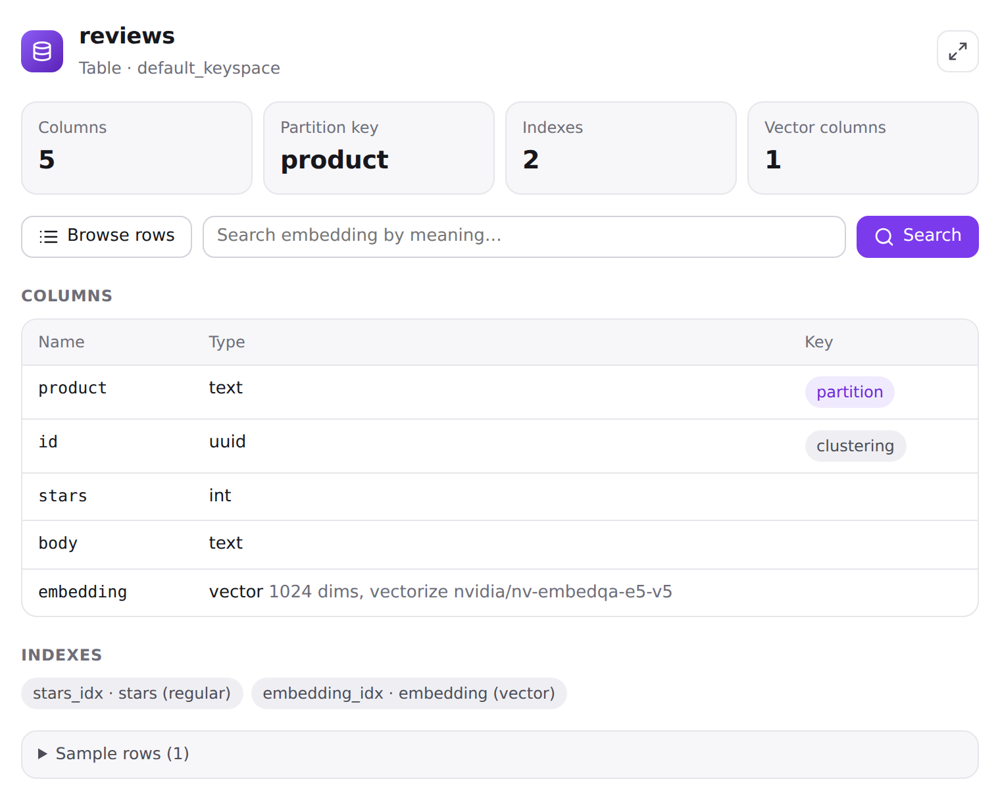
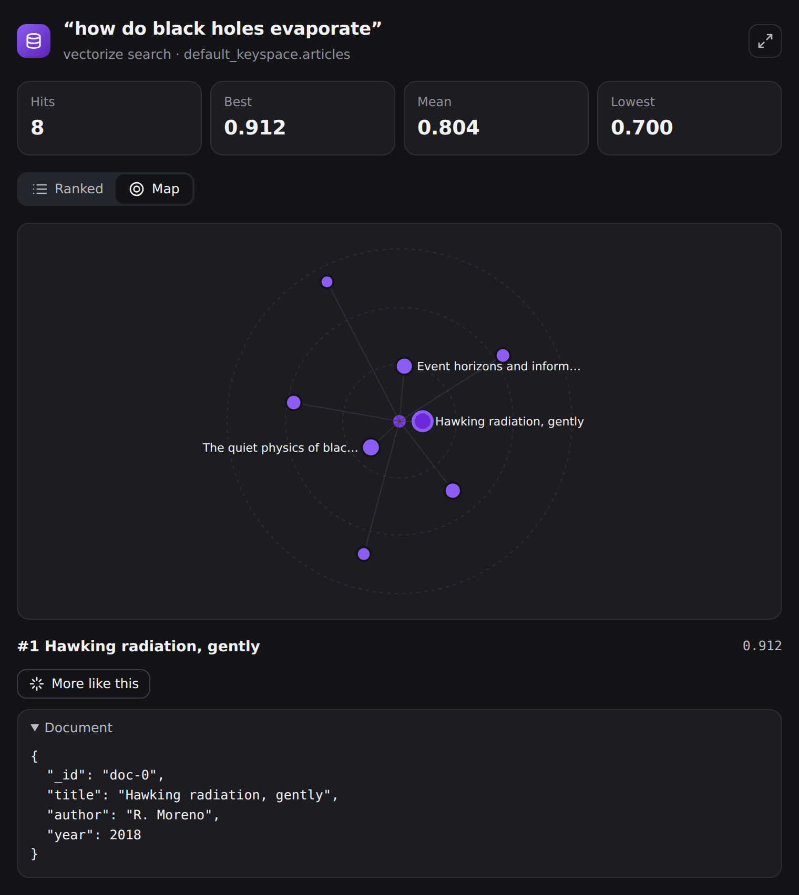

<p align="center">
  
</p>

<p align="center">
  <a href="https://github.com/erichare/astra-db-plugin/actions/workflows/ci.yml"></a>
  <a href="https://www.npmjs.com/package/@erichare/astra-mcp"></a>
  <a href="https://github.com/erichare/astra-db-plugin/releases"></a>
  <a href="https://skillsaw.org/"></a>
  <a href="LICENSE"></a>
</p>

<p align="center">
  <b>18 MCP tools · interactive views · guarded writes · ~1,660 Data API examples in 5 languages</b><br>
  Claude Code · Codex · Cursor · VS Code · Windsurf · Gemini CLI · Claude Desktop · IBM Bob · ChatGPT
</p>

Give your coding agent a live view of your Astra DB. It can map a database, read a collection's real schema before writing code against it, run vector and hybrid searches, page through documents, and change data, asking you first before anything destructive. When it writes application code, it starts from canonical Data API snippets for Python, TypeScript, Java, C#, and Go instead of guessing.

## Quickstart

```bash
npx -y @erichare/astra-mcp init
```

`init` finds the agents on your machine and sets each one up. Claude Code and Codex get the full plugin (skills, hooks, and the MCP server) from their plugin marketplaces; the others get the MCP server in their config. Then it connects a database:

1. Paste an application token at a hidden prompt. Create one in the [Astra console](https://astra.datastax.com) under **Settings → Tokens**.
2. Pick a database and a keyspace.
3. `ASTRA_DB_APPLICATION_TOKEN`, `ASTRA_DB_API_ENDPOINT`, and `ASTRA_DB_KEYSPACE` are written to `./.env` (mode 0600), and `login` offers to add `.env` to `.gitignore` if it isn't ignored yet.

No restart needed: the server re-reads credentials on every call. Now ask your agent:

> What's in my Astra database?
>
> Find articles similar to "how do black holes evaporate".
>
> Write a TypeScript script that loads `products.json` into a new vectorize collection.

Needs Node.js 20+. Prefer a one-liner? `curl -fsSL https://raw.githubusercontent.com/erichare/astra-db-plugin/main/install.sh | sh` (PowerShell: `irm https://raw.githubusercontent.com/erichare/astra-db-plugin/main/install.ps1 | iex`) runs the same `init`.

## See your data

In hosts that render [MCP Apps](https://modelcontextprotocol.io/extensions/apps/overview), such as Claude and ChatGPT, the overview, schema, explorer, and search tools answer with an interactive view: drill from a database into a collection, its documents, and similar documents, with a Back history, your host's theme, and full keyboard support. Elsewhere, the agent gets the same data as text, and can write a standalone HTML page when you ask for a visual.

<table>
  <tr>
    <td width="50%"></td>
    <td width="50%"></td>
  </tr>
  <tr>
    <td></td>
    <td></td>
  </tr>
  <tr>
    <td></td>
    <td></td>
  </tr>
</table>

In Claude Code, the shortcuts are `/astra-db:overview`, `/astra-db:collection <name>`, `/astra-db:explore <name> [--filter '<json>']`, and `/astra-db:similar "<query>" <collection>`.

## Tools

| | Tools |
| --- | --- |
| **Connect** | `connection_status` shows where each credential comes from and runs a live check; `list_databases` |
| **Explore** | `database_overview`, `describe_collection`, `describe_table`, `list_vectorize_providers` |
| **Query** | `find` (filter, sort, projection, paging), `vector_search` (text via vectorize, a vector, or "more like this document"; hybrid with rerank), `count`, `distinct_values` |
| **Build** | `code_examples` searches the bundled, documentation-derived client snippets, offline |
| **Change** | `insert`, `update`, `delete`, `create_collection`, `create_table`, `create_index`, `drop` |

Every data tool takes an optional `database` (name, id, or endpoint) and `keyspace`, so one server covers all your databases. The server also exposes `astra://databases` and per-collection schema resources, plus `overview`, `explore`, `similar`, and `setup` prompts. Arguments, outputs, and error codes: [docs/tools.md](docs/tools.md).

## Safe by default

- **Destructive changes need your say-so.** `drop`, and `update` or `delete` across many documents or with an empty filter, need confirmation. Clients that support elicitation ask you directly. Otherwise the agent has to show you what will be lost and wait for your approval; the request that started it doesn't count.
- **Read-only when you want it.** `ASTRA_MCP_READ_ONLY=1`, `astra-mcp serve --read-only`, or the plugin's *Read-only* setting removes every write tool.
- **Tokens stay out of the chat.** `login` reads the token with hidden input, and the tools send the agent to `login`, never to you for a token. If you paste one anyway, the agent is told not to use it and to suggest rotating it.
- **A guard against leaks.** In Claude Code, Codex, and Bob, a hook stops `AstraCS:` tokens from being written anywhere except a git-ignored `.env`. Removing a leaked token is always allowed.
- **Hosted writes are opt-in**, per connection: the *Allow writes* box on the OAuth consent page, or an explicit header.

More in [docs/security.md](docs/security.md).

## Works with

`init` handles all of these; pick a subset with `--agents claude-code,cursor`, use project-level files with `--project`, and preview with `--dry-run`. `npx -y @erichare/astra-mcp uninstall` reverses it.

| Agent | What you get | Manual setup |
| --- | --- | --- |
| **Claude Code** | Plugin: skills, `/astra-db:*` shortcuts, hooks, MCP server, settings for token, endpoint, keyspace, and read-only | `claude plugin marketplace add erichare/astra-db-plugin`<br>`claude plugin install astra-db@astra-db-marketplace` |
| **OpenAI Codex** | Plugin: skills (`$astra-db:*`), hooks, MCP server | `codex plugin marketplace add erichare/astra-db-plugin`<br>`codex plugin add astra-db@astra-db-marketplace` |
| **Cursor** | MCP server in `~/.cursor/mcp.json` | [](https://cursor.com/en/install-mcp?name=astra-db&config=eyJjb21tYW5kIjoibnB4IiwiYXJncyI6WyIteSIsIkBlcmljaGFyZS9hc3RyYS1tY3BAMiJdfQ%3D%3D) |
| **VS Code** (Copilot) | MCP server in your user profile | [](https://insiders.vscode.dev/redirect/mcp/install?name=astra-db&config=%7B%22type%22%3A%22stdio%22%2C%22command%22%3A%22npx%22%2C%22args%22%3A%5B%22-y%22%2C%22%40erichare%2Fastra-mcp%402%22%5D%2C%22env%22%3A%7B%22ASTRA_MCP_PROJECT_DIR%22%3A%22%24%7BworkspaceFolder%7D%22%2C%22ASTRA_MCP_CLIENT%22%3A%22vscode%22%7D%7D) |
| **Windsurf** | MCP server in `~/.codeium/windsurf/mcp_config.json` | `init --agents windsurf` |
| **Gemini CLI** | MCP server in `~/.gemini/settings.json` | `init --agents gemini` |
| **Claude Desktop** | MCP server in `claude_desktop_config.json` | Or open [`astra-db.mcpb`](https://github.com/erichare/astra-db-plugin/releases/latest/download/astra-db.mcpb) for a one-click install with a settings form |
| **IBM Bob** | Skills, `/astra-*` commands, three custom modes, rules, hooks, MCP server in `~/.bob/` | [docs/bob.md](docs/bob.md) |
| **ChatGPT, claude.ai** | Hosted server with OAuth | [docs/hosted.md](docs/hosted.md) |
| **Any MCP client** | stdio server | `npx -y @erichare/astra-mcp` |

Skills-only harnesses that read the [Agent Skills](https://agentskills.io) layout can take the `skills/` directory as is.

## What the agent knows

| Skill | Purpose |
| --- | --- |
| `astra-toolkit` | The knowledge base: Collections vs Tables, data modeling, the Astra CLI, application architecture, and about 340 examples per language with per-language indexes. Written by Stefano Lottini (IBM / DataStax), vendored and extended here |
| `astra-widgets` | When to show a view, and how to render one where MCP Apps aren't available |
| `setup`, `doctor` | Connect a project, and diagnose one that isn't working, with the exact fix per failure |
| `data-model-review` | Review the project's data model and Data API usage against the live schema |
| `overview`, `collection`, `explore`, `similar` | Shortcuts you invoke; the agent doesn't trigger them on its own |
| `reviewer`, `data-modeler`, `migration-helper` | Personas: a read-only code reviewer in a forked context, a schema designer, and a staged migration planner |

## Configuration

Each value (token, endpoint, keyspace) comes from the first place that has it:

1. The server's environment: `ASTRA_DB_APPLICATION_TOKEN`, `ASTRA_DB_API_ENDPOINT`, `ASTRA_DB_KEYSPACE`
2. The project's `.env.local` or `.env`, searched upward to the git root
3. The host's settings (the Claude Code plugin or the Claude Desktop bundle)
4. Your profile, written by `login --global`
5. The Astra CLI's `~/.astrarc` (token only)

With a token but no endpoint, the server picks your only active database, or the one named by `ASTRA_DB_NAME`. `npx -y @erichare/astra-mcp doctor` shows what it found and where. Full reference: [docs/configuration.md](docs/configuration.md).

## Documentation

[Tools](docs/tools.md) · [Configuration](docs/configuration.md) · [Security](docs/security.md) · [Hosted server](docs/hosted.md) · [IBM Bob](docs/bob.md) · [Troubleshooting](docs/troubleshooting.md) · [Privacy](docs/privacy.md) · [Publishing](docs/publishing.md) · [Changelog](CHANGELOG.md)

## Contributing

```bash
cd server && npm ci && npm test      # server, CLI, hosted, and UI view tests
node --test tests/*.test.mjs         # hooks, manifests, skills, scripts
```

See [CONTRIBUTING.md](CONTRIBUTING.md) for the layout and checks, and [AGENTS.md](AGENTS.md) if you're a coding agent working on this repository.

## License and provenance

The plugin, server, installer, hooks, and assets are [Apache-2.0](LICENSE). The `astra-toolkit` skill content is vendored from [sl-at-ibm/astra-toolkit-skill](https://github.com/sl-at-ibm/astra-toolkit-skill) and derives from the [DataStax documentation](https://docs.datastax.com); the changes made here are listed in [NOTICE](NOTICE). This is a community project, not an official DataStax, IBM, Anthropic, or OpenAI product. Product names and logos identify compatibility only and are trademarks of their owners.
