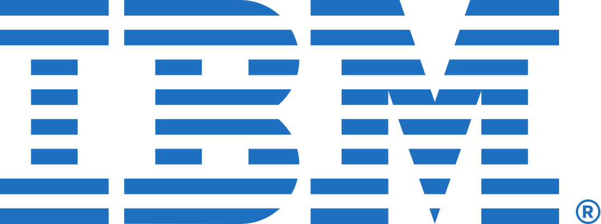
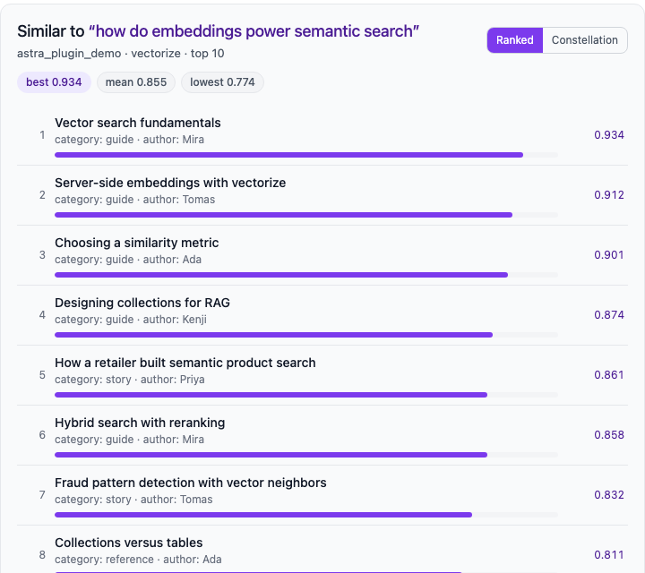
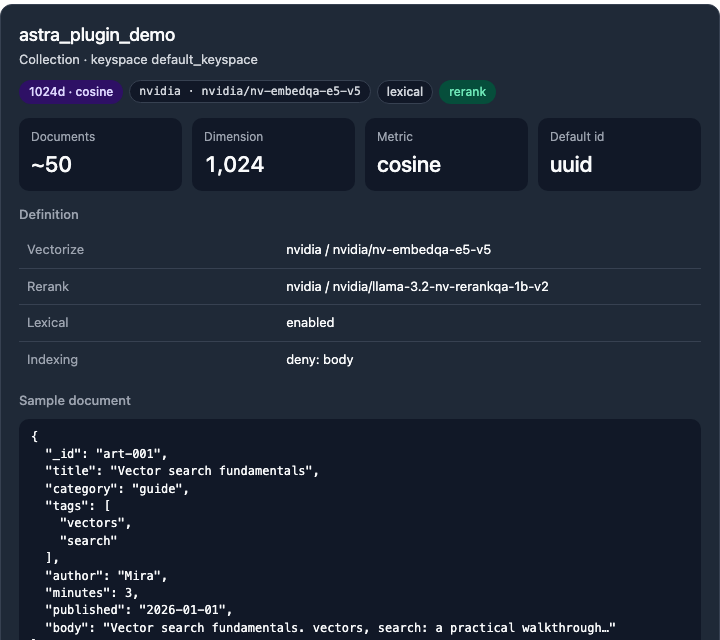
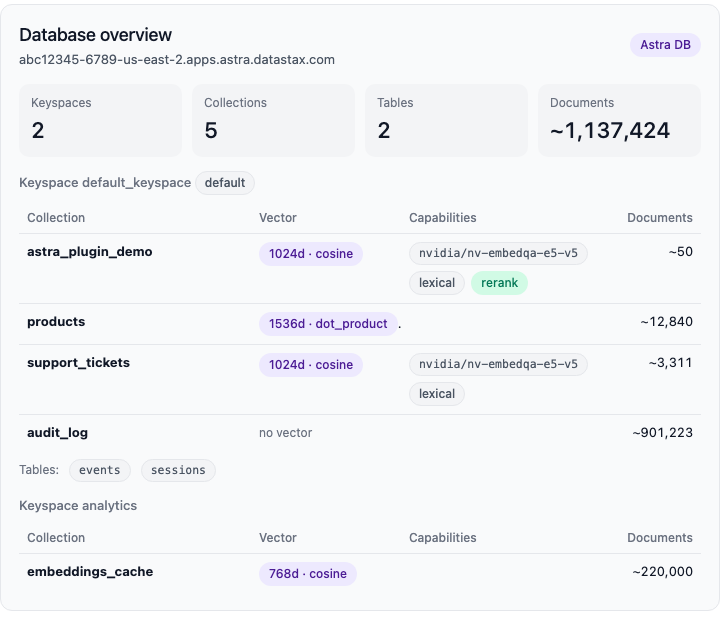
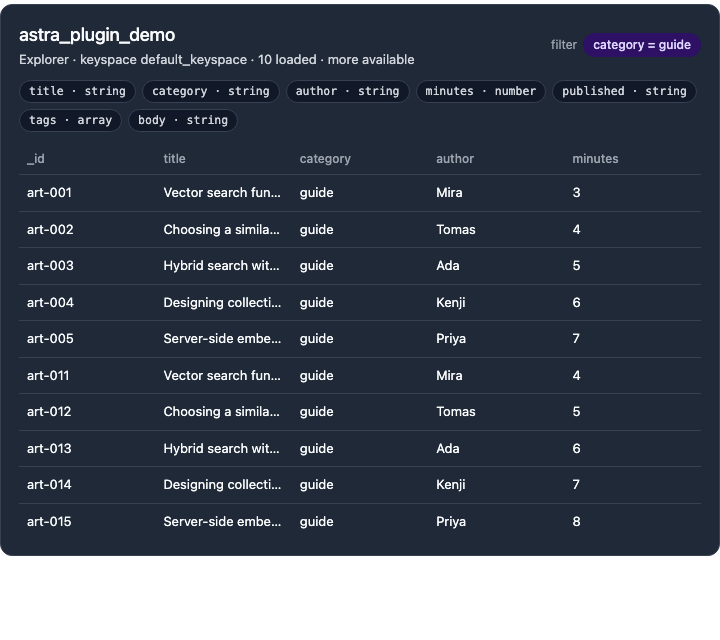

<p align="center">
  
</p>

<p align="center">
  <a href="https://github.com/erichare/astra-db-plugin/actions/workflows/ci.yml"></a>
  <a href="https://github.com/erichare/astra-db-plugin/tags"></a>
  <a href="https://skillsaw.org/"></a>
  <a href="LICENSE"></a>
</p>

<p align="center">
  <b>5 client languages · ~1,660 doc-synced Data API snippets · 4 inline widgets · ~420 always-on tokens · skillsaw A+</b>
</p>

>  **Built for IBM Bob.** Bob gets the complete bundle — the skill, three custom modes, `/astra-*` slash commands, the Astra DB MCP server, and a credential-hygiene rule — installed into a project with one command (or globally with `--global`). Claude Code and OpenAI Codex get the same capabilities in their native forms.

One skill, one source of truth, three native packagings. The content is the `astra-toolkit` skill by Stefano Lottini (IBM / DataStax) — progressive-disclosure instructions for the Astra CLI, application architecture, data modeling for Collections and Tables, and roughly 340 documentation-derived Data API snippets for each of Python, TypeScript, Java, C#, and Go. It is self-sufficient (no web lookups) and synced automatically from [sl-at-ibm/astra-toolkit-skill](https://github.com/sl-at-ibm/astra-toolkit-skill).

## Install

Pick your agent — one command each.

<p align="center">
  <a href="#ibm-bob"></a>
  <a href="#claude-code"></a>
  <a href="#openai-codex"></a>
</p>

### IBM Bob

From your project root:

```bash
curl -fsSL https://raw.githubusercontent.com/erichare/astra-db-plugin/main/install.sh \
  | bash -s -- bob
```

Installs the full bundle into `.bob/` — the skill, `/astra-setup`, `/astra-doctor`, and `/astra-data-model-review` commands, the `astra-reviewer`, `astra-data-modeler`, and `astra-migration-helper` custom modes, the Astra DB MCP server, and a credential-hygiene rule — merging with any `.bob/` config the project already has. Add `--global` to install into `~/.bob/` for every project instead.

### Claude Code

```bash
claude plugin marketplace add erichare/astra-db-plugin
claude plugin install astra-db@astra-db-marketplace
```

The full plugin: skill, commands, agents, hooks, and MCP server.

### OpenAI Codex

```bash
codex plugin marketplace add erichare/astra-db-plugin
codex plugin add astra-db@astra-db-marketplace
```

Native plugin (per the [OpenAI plugin spec](https://developers.openai.com/plugins/build/plugins)) with the skill, the `astra-setup` / `astra-doctor` / `astra-data-model-review` command skills, the `astra-reviewer` / `astra-data-modeler` / `astra-migration-helper` persona skills (Codex lists them as `astra-db:astra-*`; invoke with `$`), hooks, and the MCP server. It also appears under `/plugins` in Codex and in the ChatGPT app's Plugins tab.

<details>
<summary><b>More install options</b> — in-app commands, Cursor / Gemini CLI / any Agent Skills harness, npx, clone</summary>

<br>

- **Claude Code, inside a session:** `/plugin marketplace add erichare/astra-db-plugin` then `/plugin install astra-db@astra-db-marketplace`.
- **Any Agent Skills harness** (Cursor, Gemini CLI, anything reading the [agentskills.io](https://agentskills.io) layout): `curl -fsSL https://raw.githubusercontent.com/erichare/astra-db-plugin/main/install.sh | bash -s -- skills-dir <your-skills-directory>`, or `npx skills add erichare/astra-db-plugin`.
- **Codex, skill only** (no plugin system): `curl -fsSL .../install.sh | bash -s -- codex` copies the skill into `~/.codex/skills/astra-toolkit` (`CODEX_HOME` overrides the location).
- **Bob, by cloning:** the repository ships the complete `.bob/` bundle, so cloning it into place works too; `install.sh bob --global` puts the same bundle under `~/.bob/`.
- **From a checkout:** `./install.sh <claude|codex|bob|skills-dir PATH>` does the same without re-fetching.

</details>

## Widgets

Ask about a collection and get a widget, not a wall of text. The bundled `astra-widgets` MCP server supplies the data; the `astra-widgets` skill renders it inline where the harness can (Claude Code desktop, Claude.ai/Desktop and ChatGPT via MCP Apps) and opens a self-contained page everywhere else.

<table>
  <tr>
    <td width="50%"></td>
    <td width="50%"></td>
  </tr>
  <tr>
    <td></td>
    <td></td>
  </tr>
</table>

| Command | Widget | Drill-downs |
| --- | --- | --- |
| `/astra-db:overview` | keyspaces → collections (vector dims · metric, vectorize model, lexical/rerank, ~count) and tables | open a collection card |
| `/astra-db:collection <name>` | full metadata + sample document | explore documents, search |
| `/astra-db:similar "<query>" --collection <name>` (`--doc <id>`, `--hybrid`, `--limit`) | ranked bars with `$similarity`, constellation map, score stats | similar-to-this-document |
| `/astra-db:explore <name>` (`--filter '{…}'`, `--fields a,b`) | documents table, field inventory, paging | filter by value, next page, similar |

The widgets are proactive too: the skill tells the agent to show the matching view whenever it inspects a collection or runs a vector search for you. Codex gets the same as `$astra-overview` / `$astra-collection` / `$astra-similar` / `$astra-explore`; Bob as `/astra-*` commands — both open the generated HTML page. The server needs `node` 20+ on your PATH and the same two environment variables as the rest of the plugin.

<details>
<summary><b>ChatGPT (hosted)</b> — inline widgets via MCP Apps</summary>

<br>

The same server runs as a streamable-HTTP endpoint (`server/api/mcp.ts`, deployable to Vercel). Register it in ChatGPT's developer mode with API-key auth: `Authorization: Bearer <ASTRA_DB_APPLICATION_TOKEN>`, and pass your Data API endpoint with an `X-Astra-Endpoint` header or `?endpoint=<url>` on the connector URL. Nothing is stored server-side; every request carries its own credentials.

</details>

## What you get

| Component | Details | IBM Bob | Claude Code | Codex / ChatGPT | Other Agent Skills harnesses |
| --- | --- | :-: | :-: | :-: | :-: |
| **Skill** `astra-toolkit` | `SKILL.md` entry point, per-topic instruction files, `clients/<language>/examples/` snippet library — loaded on demand | ✓ | ✓ | ✓ | ✓ |
| **Commands** | setup (CLI, token, `.env`), doctor (diagnostics), data-model-review | ✓ `/astra-*` | ✓ `/astra-db:*` | ✓ `$astra-*` skills | — |
| **Agents** | reviewer (Data API usage review), data-modeler (schema design), migration-helper (staged migration plans) | ✓ custom modes | ✓ subagents | ✓ `$astra-*` persona skills | — |
| **MCP server** | [`@datastax/astra-db-mcp`](https://github.com/datastax/astra-db-mcp) for live database operations | ✓ | ✓ | ✓ | — |
| **Widgets** | `astra-widgets` MCP server + skill: overview, collection card, similarity view, explorer | ✓ HTML page | ✓ inline | ✓ inline (ChatGPT) · HTML page (Codex CLI) | — |
| **Hooks** | Credential guard (blocks hardcoded `AstraCS:` tokens); daily upstream-freshness notice | ≈ rule¹ | ✓ | ✓ | — |

¹ Bob has no hook system; the bundle ships a `.bob/rules/astra-db.md` rule that enforces the same credential hygiene as guidance.

**Live database tools.** The MCP server activates when `ASTRA_DB_APPLICATION_TOKEN` and `ASTRA_DB_API_ENDPOINT` are set in your environment; `/astra-db:setup` installs the Astra CLI and generates a `.env` with both. The skill itself needs no credentials.

<details>
<summary><b>Maintainers</b> — sync pipeline, CI gates, releases, evals</summary>

<br>

Content flow: `sl-at-ibm/astra-toolkit-skill` → `scripts/sync_upstream.py` → `skills/astra-toolkit/` (canonical) → `scripts/build_layouts.py` → `.bob/` bundle and `codex/` plugin root (generated from the skill plus `commands/` and `agents/` via `scripts/convert.py`, committed, parity-checked).

- **Sync**: `.github/workflows/sync.yml` runs weekly and opens a PR when upstream changed (`sync-manifest.json` records the upstream SHA). Manual refresh: `python3 scripts/sync_upstream.py && python3 scripts/build_layouts.py`.
- **Content is verbatim** with one deliberate exception: `DESCRIPTION_OVERRIDES` in `scripts/sync_upstream.py` patches the skill's frontmatter description with routing trigger phrasing (proposed upstream; the override is deleted once adopted).
- **CI** (`.github/workflows/ci.yml`): skillsaw `--strict` plus an A+ grade gate, layout parity, Python/TypeScript snippet syntax checks, the pytest suite (sync/build/release scripts, both hooks, the installer, and skill-content integrity — 90% coverage gate on `scripts/`), and `claude plugin validate`. Run locally with `pytest tests/`.
- **Evals** (`evals/`): three `claude plugin eval` cases (Python vector collection, TypeScript filtered find, Collections-vs-Tables reasoning) with `file_exists`, `tool_used: Skill`, and LLM rubric graders. `plugin eval` is early-access; run `claude plugin eval . --no-publish` once enabled for the account.
- **Releases** (`.github/workflows/release.yml`): merges touching plugin content auto-bump the patch version across the Claude and Codex manifests, tag, and update the changelog. Use `scripts/bump_version.py minor|major` manually for larger changes.
- **Manifests / roots**: repo root is the Claude Code plugin (`.claude-plugin/` plugin + marketplace, `.mcp.json`, `hooks/`, `commands/`, `agents/`); `codex/` is the self-contained Codex plugin root (`codex/.codex-plugin/plugin.json`, generated `skills/`, `hooks/` copy, `.mcp.json`) published via `.agents/plugins/marketplace.json`; `.bob/` is the generated IBM Bob bundle.

</details>

## License and provenance

<p align="center">
  <picture>
    <source media="(prefers-color-scheme: dark)" srcset="assets/logos/datastax-wordmark-dark.svg">
    
  </picture>
</p>

Packaging (scripts, commands, agents, hooks, workflows, assets) is [Apache-2.0](LICENSE). Bundled skill content originates from [sl-at-ibm/astra-toolkit-skill](https://github.com/sl-at-ibm/astra-toolkit-skill) and derives from the [DataStax documentation](https://docs.datastax.com); see [NOTICE](NOTICE). Maintained in coordination with the upstream author. This is a community project, not an official DataStax, IBM, Anthropic, or OpenAI product; platform names and logos identify compatibility only and are trademarks of their respective owners (see [NOTICE](NOTICE)).
